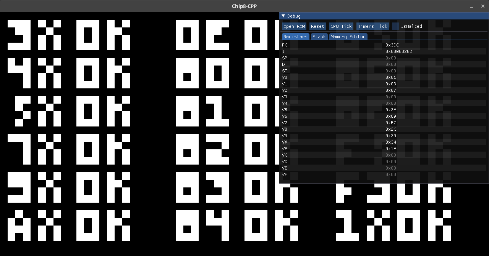

CHIP-8 Emulator
==============

A basic **work-in-progress** [CHIP-8](https://en.wikipedia.org/wiki/CHIP-8) emulator written in C++ with [SFML](https://www.sfml-dev.org/)



Build Instructions
==================

**Dependencies**

| Package                                                   | Version       |
| --------------------------------------------------------- | ------------- |
| CMake                                                     | >= 3.15       |
| [SFML](https://www.sfml-dev.org/)                         | >= 2.5.0      |
| [ImGui](https://github.com/ocornut/imgui)                 | >= 1.85       |
| [ImGui-SFML](https://github.com/eliasdaler/imgui-sfml)    | >= 2.3        |

**Linux/Unix**

```
$ git clone --recurse-submodules https://github.com/CrossCRS/chip8cpp
$ cd chip8cpp
$ ./extern/vcpkg/bootstrap-vcpkg.sh
$ cmake -G Ninja -B build -S . -DCMAKE_TOOLCHAIN_FILE=extern/vcpkg/scripts/buildsystems/vcpkg.cmake -DCMAKE_BUILD_TYPE:STRING=Release
$ cmake --build build/
```

Or use the provided Dockerfile